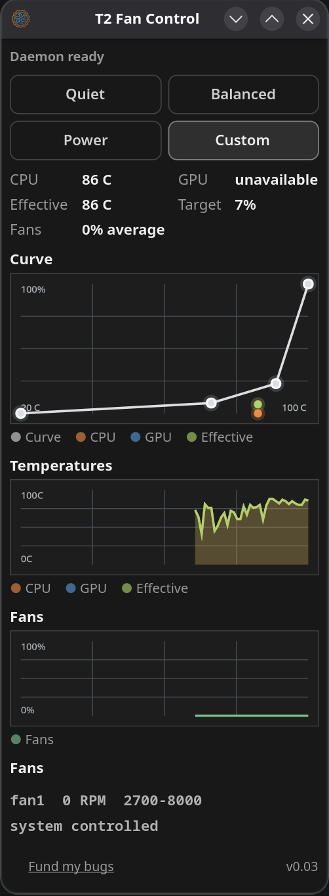

# T2 Fan Control

<p align="center">

</p>

<p align="center">

</p>
Fan controller application written in Rust for T2 Macs running Linux.
Supports applesmc, macsmc hwmon and t2smc (https://github.com/deqrocks/t2-smc) hwmon paths.


T2 Fan Control provides a compact desktop interface for monitoring temperatures and editing a four-point fan curve with a model-specific system-temperature limit.

Fan control is handled by a background daemon integrated with systemd. This keeps the state persistent across boot, suspend and resume, while the GUI talks to the daemon over a Unix socket.

## How fan control works

The controller deliberately keeps normal component cooling and retained system heat separate. It samples the available temperatures every two seconds and derives three different values.

### Curve temperature

The editable fan curve follows the hotter of the CPU and GPU. It does not use an average and it does not use unrelated board, storage or enclosure sensors.

- CPU is the Intel package temperature exposed by `coretemp`.
- GPU is the highest available reading from GPU Proximity, GPU Die digital, GPU Die analog and GPU Voltage Regulator.
- If no GPU temperature is available, the curve follows CPU alone. The UI changes its description accordingly.
- If only a GPU temperature is available, the curve follows GPU alone.

`Curve temp` shows the value currently fed into the curve. `Curve sensor` identifies the CPU or GPU sensor responsible for that value.

### System temperature and system limit

The system temperature is the arithmetic mean of every currently readable positive temperature: CPU, GPU and all available SMC temperature sensors. Zero, negative and unreadable values are ignored. This broad average is intended to reflect heat retained by the logic board, cooling assembly and enclosure without depending on one model-specific case sensor.

The red vertical wall in the curve editor is the configurable system-temperature limit:

- When the system average reaches the wall, both fans are forced to 100%.
- Forced cooling remains active until the system average is 5 C below the wall.
- For example, a 50 C limit engages at 50 C and releases at 45 C.
- The 5 C hysteresis prevents rapid fan cycling around the limit.
- The wall can be moved from 30 C to 110 C.

The system limit is controlled only by the system average. A high CPU or GPU temperature continues to follow the normal curve and cannot independently engage the system-limit latch.

### Editing the curve

The curve contains exactly four points:

- The left point is fixed at `0 C / 0%`.
- The two middle points can be moved horizontally and vertically, but cannot cross each other or the system wall.
- The right point is attached to the system wall and can only be moved vertically.
- Moving the system wall horizontally scales the two middle temperatures proportionally, preserving the shape of the curve.

Fan percentages are relative to each fan's reported minimum and maximum RPM. Therefore `0%` means the hardware minimum RPM, not a stopped fan.

### Monitoring values

`Hottest sensor` is informational and is independent of the fan-curve input. It reports the highest positive reading among all monitored sensors using a human-readable name, for example `PCH Die · 78 C`. The fan details show how many valid temperature sensors are currently being monitored.

## Default configuration

New installations use:

```ini
config_version=2
automatic_control_enabled=true
autostart_enabled=false
system_temp_limit_c=50
custom_curve=0:0,16:2,38:7,50:18
```

Curve entries use `temperature:speed-percent` pairs. The active configuration is stored at:

```text
/etc/t2-fancontrol/config.txt
```

It can be inspected with:

```bash
sudo cat /etc/t2-fancontrol/config.txt
```

Configurations from the earlier preset-based controller do not describe the new control model safely. A file without `config_version=2` is therefore replaced with the defaults above when the daemon starts. Once migrated, version 2 user changes are preserved.

## Installation

1. Download or clone the repository
2. Unpack it
3. Run:

```bash
make
sudo make install
```
This step is mandatory. It puts the binary, desktop entry, icon and systemd service in the correct system locations, then enables and starts `t2-fancontrol.service`.

If `t2fanrd.service` is present, `sudo make install` disables and stops it automatically to avoid conflicts.

`sudo make install` does all of the following:

- installs the binary to `/usr/local/bin/t2-fancontrol-gtk`
- installs the desktop entry to `/usr/local/share/applications/org.t2fancontrol.gtk.desktop`
- installs the icon to `/usr/local/share/icons/hicolor/scalable/apps/org.t2fancontrol.gtk.svg`
- installs the systemd unit to `/usr/local/lib/systemd/system/t2-fancontrol.service`
- reloads systemd
- enables and starts `t2-fancontrol.service`
- disables and stops `t2fanrd.service` if it exists

## Uninstall

```bash
sudo make uninstall
```

This removes the installed files, disables `t2-fancontrol.service`, and re-enables `t2fanrd.service` if it is present on the system.

`sudo make uninstall` does all of the following:

- disables and stops `t2-fancontrol.service`
- removes the installed binary
- removes the desktop entry
- removes the installed icon
- removes the installed systemd unit
- reloads systemd
- re-enables and starts `t2fanrd.service` if it exists

## Build Dependencies

You need a Rust toolchain and the usual native build dependencies for GTK4 and Libadwaita.

- `cargo`
- `make`
- `pkg-config`
- `glib-compile-resources`
- GTK4 development files
- Libadwaita development files

## Support

[Fund my bugs](https://donate.stripe.com/eVq14n8a7agh2lQdqq14400)
