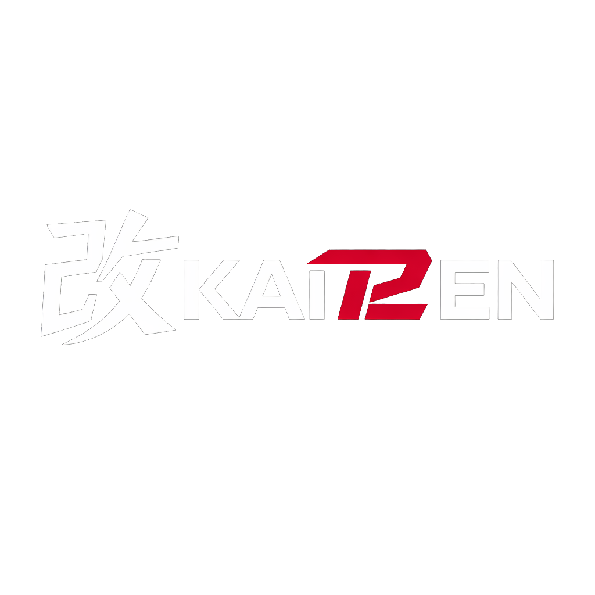

{ .kait2en-page-logo }

# Introduction

Howtos:

- [Introduction](introduction.md) (you are here)
- Installation
  - [Automatic installation](installation/automatic/index.md)
  - Manual installation
    - [Get Broadcom firmware](installation/manual/00-get-broadcom-firmware.md)
    - [Prepare macOS and Fedora USB](installation/manual/01-prepare-macos-and-fedora-usb.md)
    - [Install Broadcom firmware](installation/manual/02-install-broadcom-firmware.md)
    - [Install KAIT2EN modules and apps](installation/manual/03-install-kait2en-modules-and-apps.md)
- Migration
  - [Revert T2 Linux Fedora to vanilla + KAIT2EN](migration/revert-t2linux-fedora.md)
- Post-install
  - [Configure GPUs](postinstall/configuring-gpus.md)
  - [How to update](postinstall/updating.md)

**This repository is meant to be copied to a USB drive before installation. Keep
that drive connected while working through these guides**. Whenever a guide asks you
to run a script or paste a command block, do that in a terminal in the **root folder of
this repository**. The guides and scripts use relative paths, so files are 
expected below the KAIT2EN USB root folder.

KAIT2EN can be installed in two ways:
- clean install on top of vanilla Fedora. 
- clean install on top of existing T2 Linux Fedora and reverting to vanilla Fedora + KAIT2EN
as described in [revert guide](migration/revert-t2linux-fedora.md).

On vanilla Fedora install internal keyboard and trackpad won't work on MacBooks.
Also WiFi will not. USB ethernet will work though.

The DKMS modules in this repository build against the currently installed
kernel. And they will rebuild automatically on kernel updates.

The setup is intentionally explicit. You will use the terminal, run commands and
know which file was installed where. The point is to make the setup understandable
and repairable.

**macOS must stay installed.** It is the clean source for Apple firmware, it can
recover T2/bridgeOS hardware states, and it is the only place where bridgeOS
panic logs are available. If you want to erase macOS completely, KAIT2EN is the
wrong path. We are focussed on fixing and debugging things. Don't ask for support
when using custom installations.

Firmware files copied from macOS are never distributed by KAIT2EN. The guides
only show how to copy the correct firmware files from your own Mac and install
them locally.

So for now best luck for the installation. If you happen to run into issues or inconsistencies,
please file an issue on GitHub or join the [KAIT2EN community on Discord](https://discord.gg/AGfjRk4ydj)
or the [KAIT2EN Matrix space](https://matrix.to/#/%23kait2en:matrix.org).

Next: [Get Broadcom firmware from macOS](installation/manual/00-get-broadcom-firmware.md)
